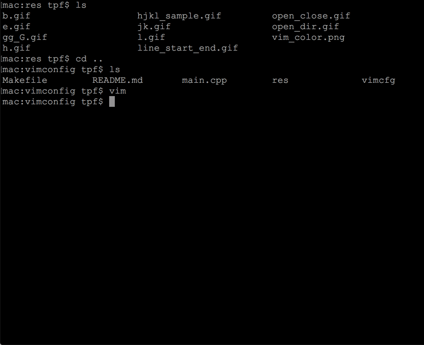
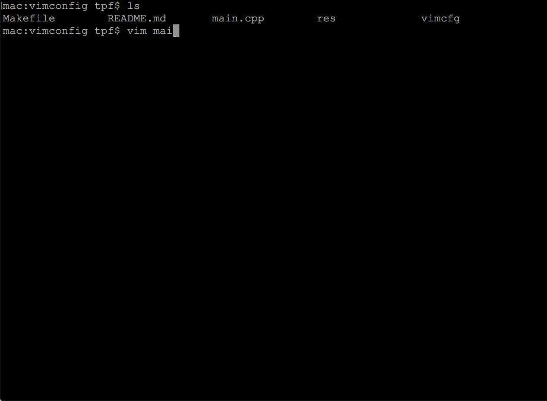
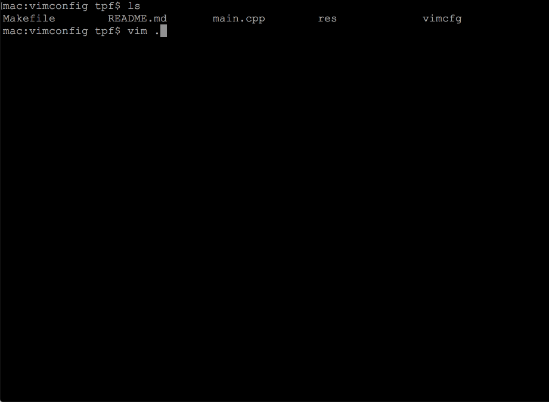
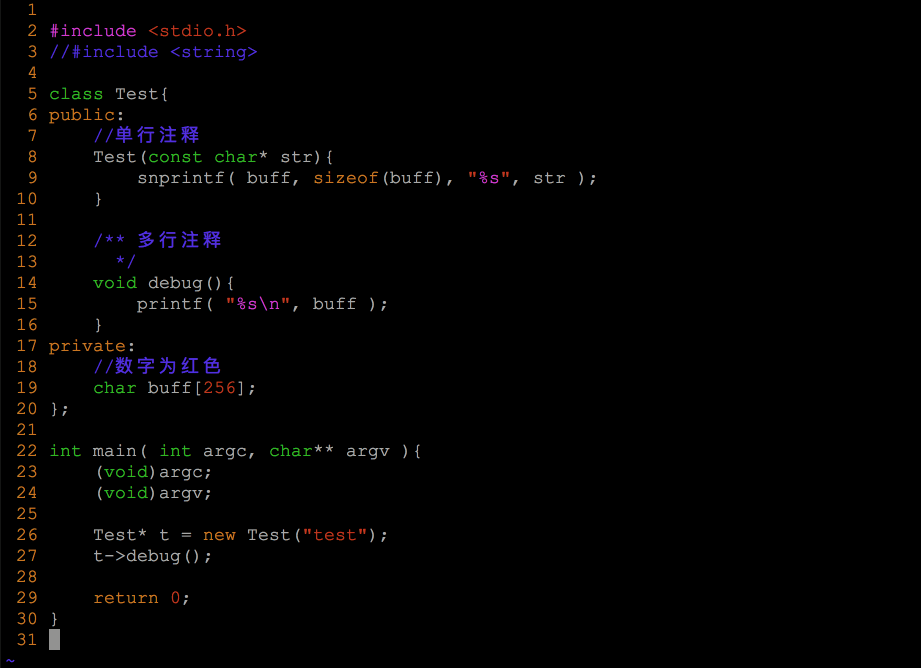
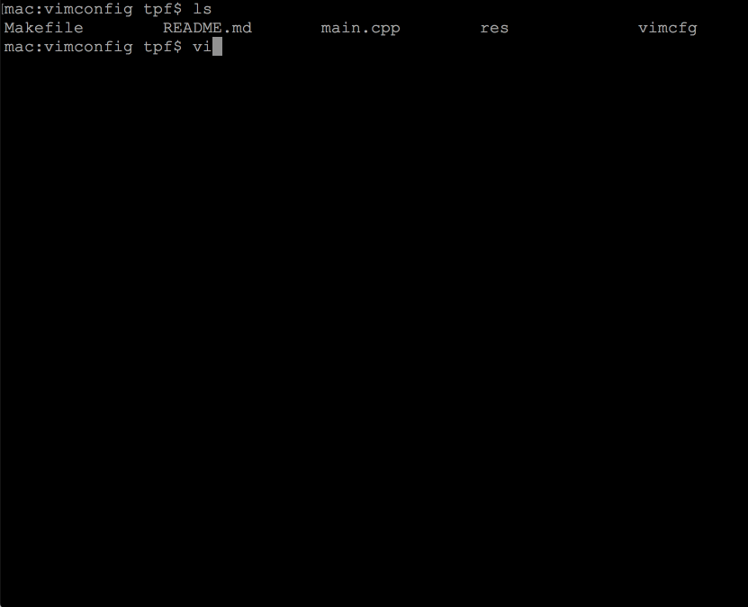
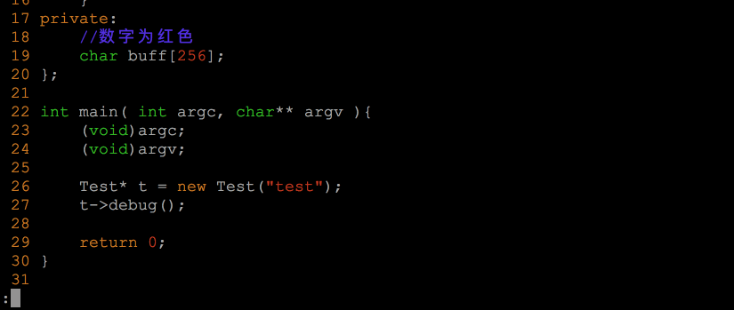

##简明的vim常用指令介绍和我用了多年的vim配置文件

	最近有同事想用vim,借着这样的机会,我就向没有用过vim,想用vim的同学简明介
	绍一下,为了让各位有比较直观的感受,我特意吐血配了一些激情小动图,希望大家
	喜欢.

	所以此文的面向对象是没用过vim,想了解vim的同学.

	一开始用vim的时候下载了很多插件,因为当时已经习惯vs了,用vim时候想尽量贴
	近vs习惯,后来随着时间退移, 发现用到的功能越来越少,比如开始用到的Tlist,cope
	在后来的代码编辑中不知道为啥渐渐不怎么用了,不过浏览开源工程时候还是挺好
	用的,打开Tlist可以看到文件的函数定义. 
	到最后整理出vimconfig的时候就只有一点点功能了，对我来说最实用的还是代
	码颜色这块,当时主要是为了配出喜欢的c,cpp代码的颜色,有兴趣的可以看
	vimcfg/.vim/syntax/tpf.vim 和vimcfg/.vim/color/c.vim文件一个是
	语法匹配,一个是颜色定义,这个是2010年的时候配的,长期不看,其实我也不
	怎么记得了.
	
	最终的配色就是这样:


## 安装vim
* ubuntu可以用下面这行命令安装
```c
bash$ sudo apt-get install vim 
```
* centos可以用下面这行命令安装
```c
bash$ sudo yum install vim 
```

## 安装vim confg
    安装配置文件只需要把vimcfg下的.vim .vimrc复制到~/目录下就可以了. 
    可以使用命令复制到目录~/下
```c
bash$ cp -rf vimcfg/.* ~/
```

## 使用vim
* 打开空的vim编辑器,在bash下输入 vim 即可
```c
bash$ vim 
```


* 退出vim
```c
在vim里输入 :q 然后回车
```

* 用vim编辑main.cpp,注意下面图中退出时候我用的是:q! 加!号表示强制退出,这个是习惯问题,就好比我在vs中写代码,当写完一段的时候下意识的按ctrl+shift+s,有时候会按住ctrl+shift+狂点s,我想这个时候我应该是已经进入高潮了,在vim里打完一段时候下意识的点:w,esc是一样的,:w就是保存的意思,esc表示退出编辑状态,而且按esc时候也有狂点esc的毛病,这个会在后面介绍编辑模式时候说到.
```c
bash$ vim main.cpp
```


* 还可以用vim打开一个目录,比如下面我打开当前目录,便会列出该目录下的所有文件. 使用j,k可以上下移动光标,选中想进入的文件后,按回车便可进入该文件,一般在工程
不熟的时候可以用这个命令在多个文件中切换,如果是自己写的项目,大多数文件名都
在心里记着, 直接vim 文件名前几个字符+tab补全就可以快速编辑该文件.
```c
bash$ vim .
```


* 移动光标,是vim里最常用的指令,使用vim的过程,在我看来基本上就是在移动光标,可以用hjkl也可以用方向键,但是强烈建议一开始就用hjkl来控制方向,这样可以极大的提高代码编辑速度,因为手可以不用在字母与方向键之间来回切换.一打开文件的时候,是正常模式,这个时候可以用hjkl在代码间来回移动,下面列出常用的移动光标指令

  一共有12种:

  * h 对应 左, 相当于 方向键的左


  * l 对应 右, 相当于 方向键的右


  * j 对应 下, 相当于 方向键的下
  * k 对应 上, 相当于 方向键的上


  * 0 (数字0)跳到一行的开头
  * $ 跳到一行的结尾


  * e 跳到一个单词的结尾


  * b 跳到一个单词的开头


  * gg 跳到文件开头
  * G 跳到文件结尾


  * ctrl + f 向下翻一页
  * ctrl + b 向上翻一页


* 下面说插入模式,就是打代码时候用的,
这里我引用一下这位同学[宙斯黄](https://www.cnblogs.com/zeushuang/archive/2012/11/16/2772830.html)的教程,因为我组织了半天也不知道该怎么明白的把下面的指令说清楚,惭愧惭愧

  这是我常用的4个插入指令:
  * i 在光标所在字符前开始输入文字并进入插入模式


  * a 在光标所在字符后开始输入文字并进入插入模式


  * o (小写字母o) 在光标所在行的下面单独开一新行来输入文字并进入插入模式


  * O (大写字母O) 在光标所在行的上面单独开一新行来输入文字并进入插入模式。


  下面是经过岁月洗礼,渐渐被我遗忘的指令,如果不是写这篇文章,我可能再也想不起来插入还有下面这些指令,有兴趣的可以了解一下,因为我不怎么用,就不介绍了
  * s 删除光标所在的字符并进入插入模式
  * I 在行首开始输入文字并进入插入模式。此行首指第一个非空白字符处。如果行首有空格，则在空格之后输入文字并进入插入模式
  * A 在行尾开始输入文字并进入插入模式。这个好用，您不必管光标在此行的什麽地方，只要按 A 就会在行尾等着您输入文字。
  * S   删除光标所在行并进入插入模式
  
* 退出插入模式,就是再回到正常模式,嗯,你猜对了就是esc,一个神奇的能让你高潮的按键,下面图中可以看到我点了o进入插入模式,写了asb然后esc退出插入模式,上下移动了光标,再点a进入了插入模式,写了asb,然后又点了esc退出插入模式,然后又上下移动了几下,强烈建议大家在看小动图的时候也新身实践一下,体验用vim写代码的快感
  * esc


* 和删除相关的指令,注意使用删除指令前需要先esc退出插入模式,为方便演示,下面的指令中用到了u,即回退,比如删掉一行后想撤销删除,可以点u
  * dd 删掉一行


  * dw 从光标删掉单词结尾,下图中注意我在一个单词的开头和中间分别用了dw,可以看出效果的不同

 
  * D 从光标删掉到行尾


* 和复制相关的指令,下面的演示中用到了粘贴指令p

  * yy 复制整行,下图中用到的指令是 yy + p,即可复制并粘贴整行


  * yw 从光标开始复制到单词的结尾,下图中用yw后用o切到了下一行并进入了插入模式,然后esc退出插入模式,再p粘贴


  * y$ 从光标开始复制到行尾,下图中用y$后同样用了o,最后在粘贴完后用了i,tab,tab把代码对齐


* 粘帖
  * p 嗯就是把刚刚复制的文本,粘贴到光标处

* 视图模式,这个功能中可以选中一段代码,并结合上面的光标和删除命令达到删除多行的效果.嗯,Words is cheap, show me the gif!

  * v 在正常模式中,按v可以进入视图模式,下面演示中用了v+移动光标hjkl,可以看到是选中代码的效果,这样就可以结合y复制,结合d删除,后面我们在动图中会一一演示
 

  * v+y 实现复制选中的文本,下图中用到v+l选中,y复制选中的文本,o在下行插入,esc退出插入,p粘贴,同理可以用v+j, v+k选中多行,然后复制,这个可以自己实践一下
 

  * v+d 实现复制删除选中的文本,下图中用到v+l选中,d删除选中的文本
 
  
  * v+e 选中从光标到单词结尾
  * v+b 选中从光标到单词开头
  * v+0 选中从光标到行头的文本
  * v+$ 选中从光标到行尾的文本
  * v+gg 选中从光标到文件开头
  * v+G 选中从光标到文件结尾
  * v+ctrl+f 向下翻页并选中从光标到下一页的文本
  * v+ctrl+b 向上翻页并选中从光标到上一页的文本

  从以上几个选中的指令中可以看到对移动光标的熟练程度直接影响了vim编辑的熟练度,所以当我们一开始用vim时候应该有意无意的多移动光标,当能做到光标随着眼睛动的时候基本上就练成九阳神功了.

  * 重点讲一下ctrl+v,表示选中一块代码,可以实现一些神奇的效果,同样上图就清楚了,下面我先用了ctrl+v，然后移动光标选中一块代码后,用了d删除选中的代码,又用u撤销删除了,其中一个细节就是每次做完一个操作后，都习惯性的用esc+:w保存了一下


  * 同样的ctrl+v也可以和其他移动光标的指令结合实现选中不同文本的效果,因为和上面差不多,我在这里就不一一演示了,动图已经动到吐血了.

