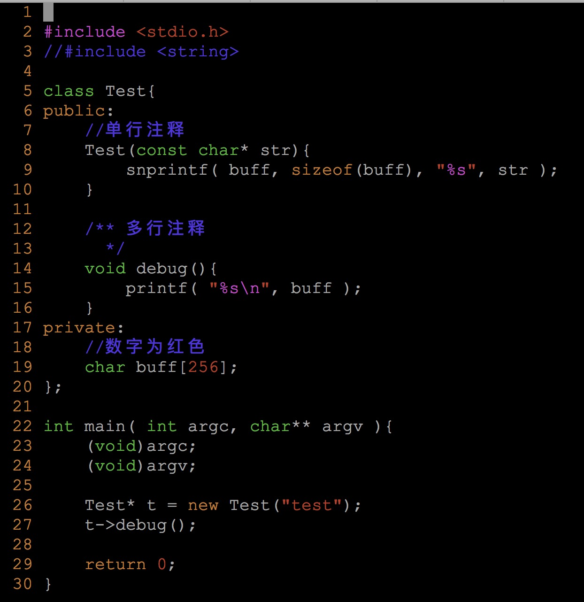

#简明的vim常用指令介绍和我用了多年的vim配置文件

		最近有同事想用vim,借着这样的机会,我就向没有用过vim,想用vim的同学简明介绍一下,为了让各位有比较直
	观的感受,我配了一些动图.
		所以此文的面向对象是没用过vim,想了解vim的同学.
    	一开始用vim的时候下载了很多插件,因为当时已经习惯vs了,用vim时候想尽量贴近vs习惯,后来随着时间退移, 
	发现用到的功能越来越少,比如开始用到的Tlist,cope在后来的代码编辑中不知道为啥渐渐不怎么用了,不过浏览开
	源工程时候还是挺好用的,打开Tlist可以看到文件的函数定义. 
   	到最后整理出vimconfig的时候就只有一点点功能了，对我来说最实用的还是代码颜色这块,当时主要是为了配
	出喜欢的c,cpp代码的颜色,有兴趣的可以看vimcfg/.vim/syntax/tpf.vim 和vimcfg/.vim/color/c.vim文件一个是
	语法匹配,一个是颜色定义,这个是2010年的时候配的,长期不看,其实我也不怎么记得了,呵呵,只是留下了这个配置. 

	
	最终的配色就是这样:


## 安装vim
    * ubuntu可以用下面这行命令安装
```c
bash$ sudo apt-get install vim 
```
    * centos可以用下面这行命令安装
```c
bash$ sudo yum install vim 
```

## 安装vim confg
    安装配置文件只需要把vimcfg下的.vim .vimrc复制到~/目录下就可以了. 
    可以使用命令复制到目录~/下
```c
bash$ cp -rf vimcfg/.* ~/
```

## 使用vim
    * 打开空的vim编辑器,在bash下输入 vim 即可
```c
bash$ vim 
```


	* 退出vim
```c
在vim里输入 :q 然后回车
```

    * 用vim编辑main.cpp,可以用
```c
bash$ vim main.cpp
```


    * 还可以用vim打开一个目录,比如下面我打开当前目录,便会列出该目录下的所有文件. 
      使用j,k可以上下移动光标,选中想进入的文件后,按回车便可进入该文件,一般在工程不熟的时候
      可以用这个命令在多个文件中切换,如果是自己写的项目,大多数文件名都在心里记着, 
      直接vim 文件名前几个字符+tab补全就可以快速编辑该文件
```c
bash$ vim .
```


	* 移动光标,是vim里最常用的指令,使用vim的过程,在我看来基本上就是在移动光标,
	  可以用hjkl也可以用方向键,但是强烈建议一开始就用hjkl来控制方向,这样可以极大的提高
	  代码编辑速度,因为手可以不用在字母与方向键之间来回切换.
	  一打开文件的时候,是正常模式,这个时候可以用hjkl在代码间来回移动,下面是我常用的移动光标指令

	  一共有12种指令,为了让各位有个直观我感受,我配了一些动图:

	  * h 对应 左, 相当于 方向键的左


	  * l 对应 右, 相当于 方向键的右


	  * j 对应 下, 相当于 方向键的下
	  * k 对应 上, 相当于 方向键的上


	  * 0 跳到一行的开头
	  * $ 跳到一行的结尾


	  * e 跳到一个单词的结尾


	  * b 跳到一个单词的开头


	  * gg 跳到文件开头
	  * G 跳到文件结尾


	  * ctrl + f 向下翻一页
	  * ctrl + b 向上翻一页

